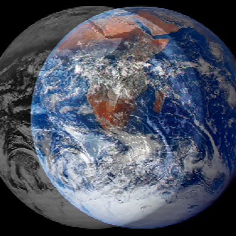
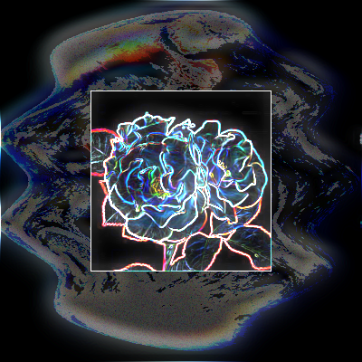
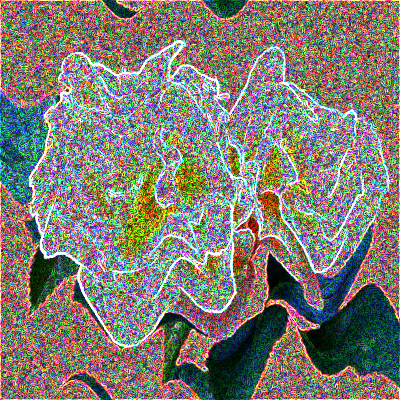
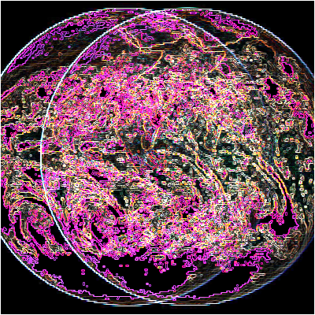
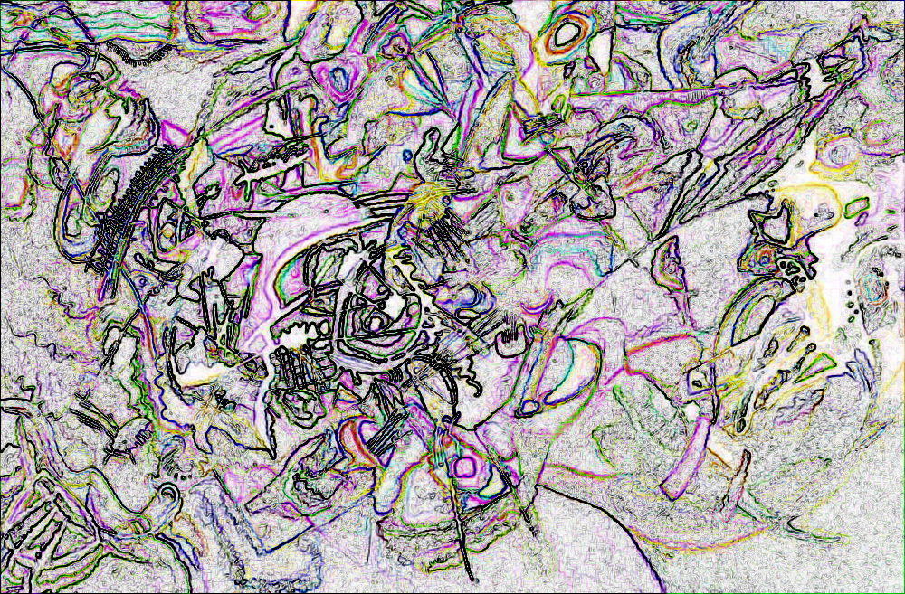

# pixmap-ops

Image manipulation demos based on the PPM image format.


## How to build

*Windows*

Open git bash to the directory containing this repository.

```
pixmap-ops $ mkdir build
pixmap-ops $ cd build
pixmap-ops/build $ cmake -G "Visual Studio 17 2022" ..
pixmap-ops/build $ start pixmap-ops.sln
```

Your solution file should contain two projects: `pixmap_art` and `pixmap_test`.
To run from the git bash command shell, 

```
pixmap-ops/build $ ../bin/Debug/pixmap_test
pixmap-ops/build $ ../bin/Debug/pixmap_art
```

*macOS*

Open terminal to the directory containing this repository.

```
pixmap-ops $ mkdir build
pixmap-ops $ cd build
pixmap-ops/build $ cmake ..
pixmap-ops/build $ make
```

To run each program from build, you would type

```
pixmap-ops/build $ ../bin/pixmap_test
pixmap-ops/build $ ../bin/pixmap_art
```

## Image operators

- Resize an image

- Flip an image horizontally or vertically
<div style="display:flex;">
  
  
</div>
- Rotate an image 90 degrees

- Get a sub-image from a given image

- Replace a portion of an image with another image

- Swirl the colors of an image

- Convert an image to grayscale

- Add a border around an image

- Invert colors of an image

- Gamma correct an image
<div style="display:flex;">
  
  
</div>
- Blend two images together

- Apply glow effect to an image

- Apply sobel operator to an image

- Apply painterly effect to an image

- Create a pixelated version of a image

- Fill one color in an image with another color

- Jitter the colors in an image

- Add two images together

- Subtract two images

- Find the absolute difference between two images

- Multiply two images

- Brighten an image

- Dim an image

- Sharpen an image

- Apply a vertical or horizontal gradient to an image
<div style="display:flex;">
  
  
</div>
- Blur an image using box blur or Gaussian blur
<div style="display:flex;">
  
  
</div>
- Glitch an image

- Distort an image vertically or horizontally
<div style="display:flex;">
  
  
</div>
- "Deep fry" an image


## Results

|   |   |
|---|---|
|||
||||
||
|||
|||
|||

