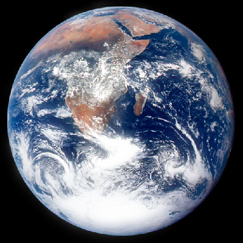
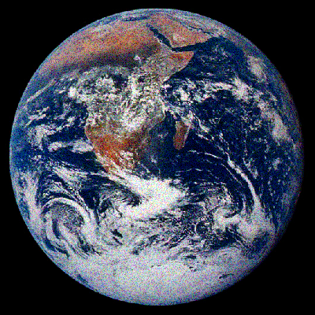

# pixmap-ops

Image manipulation demos based on the PPM image format.

TODO: Add a representative image for your project here

## How to build

*Windows*

Open git bash to the directory containing this repository.

```
pixmap-ops $ mkdir build
pixmap-ops $ cd build
pixmap-ops/build $ cmake -G "Visual Studio 17 2022" ..
pixmap-ops/build $ start pixmap-ops.sln
```

Your solution file should contain two projects: `pixmap_art` and `pixmap_test`.
To run from the git bash command shell, 

```
pixmap-ops/build $ ../bin/Debug/pixmap_test
pixmap-ops/build $ ../bin/Debug/pixmap_art
```

*macOS*

Open terminal to the directory containing this repository.

```
pixmap-ops $ mkdir build
pixmap-ops $ cd build
pixmap-ops/build $ cmake ..
pixmap-ops/build $ make
```

To run each program from build, you would type

```
pixmap-ops/build $ ../bin/pixmap_test
pixmap-ops/build $ ../bin/pixmap_art
```

## Image operators

TODO: Document the features of your PPM image class here. Include example images.
- Resize an image\

- Flip an image horizontally or vertically\


- Rotate an image 90 degrees\

- Get a sub-image from a given image\

- Replace a portion of an image with another image\

- Swirl the colors of an image\

- Convert an image to grayscale\

- Add border around an image\

- Invert colors of an image\

- Gamma correct an image\


- Blend two images together\

- Apply glow effect to an image\

- Apply sobel operator to an image\

- Apply painterly effect to an image\

- Create a pixelated version of a image\

- Fill the white in an image with another color\

- Jitter the colors in an image\

- Add two images together\

- Subtract two images\

- Find the difference between two images (absolute value)\

- Multiply two images\

- Brighten an image\

- Dim an image\

- Sharpen an image\

- Apply a vertical or horizontal gradient to an image\


- Blur an image using box blur or Gaussian blur\

- Glitch an image\

- Distort an image\

- "Deep fry" an image\


## Results

TODO: Show artworks using your class

